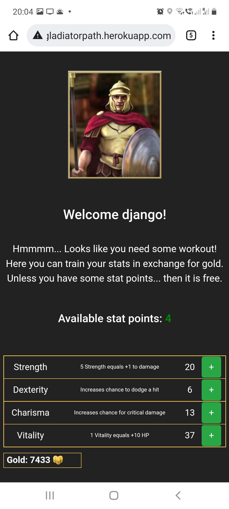

# Gladiator-s-Path

Mobile responsive browser game about gladiators built with Flask web framework. 
Register an account and start playing. In this game you will create your own warrior. The goal is to get the highest level in the Ranking.
Gain experience and level up by killing monsters suitable for your level. Train statistics and buy new Items which will increase your damage,armor,HP or even stats.
Recover your HP by buying food or potions at potion master. For each level you will gain some stat points and your HP will increase.  

How to play: 
- clone this repository 
- run: 'pip install -r requirements.txt' in command prompt  
- run: 'python run.py' and go to http://127.0.0.1:5000/ in your webbrowser.  

or start playing this game <a href="https://gladiatorpath.herokuapp.com/">here</a> (app may need few moments to start working) 
Have fun!  

Screenshots below  

